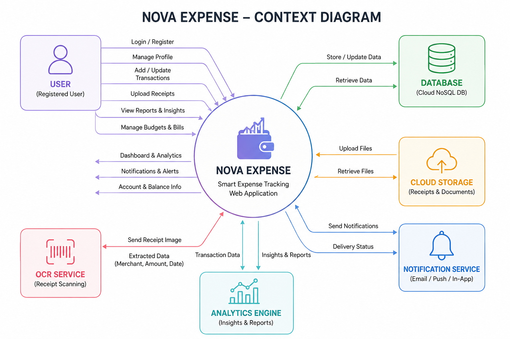
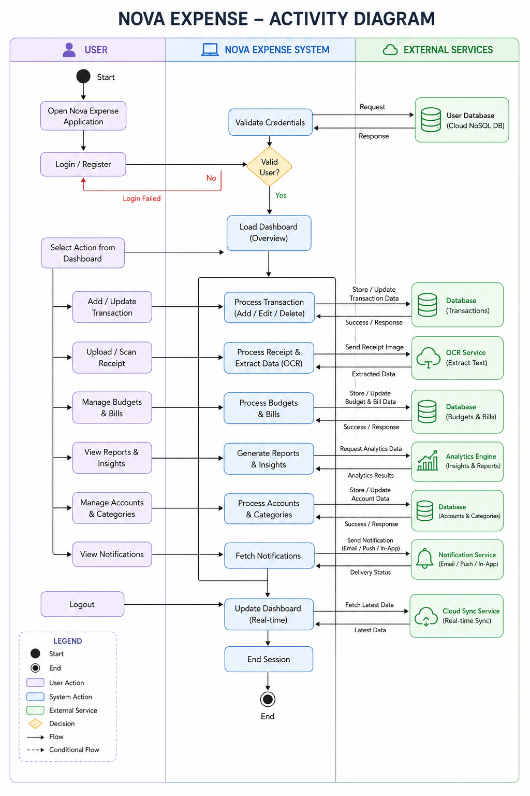
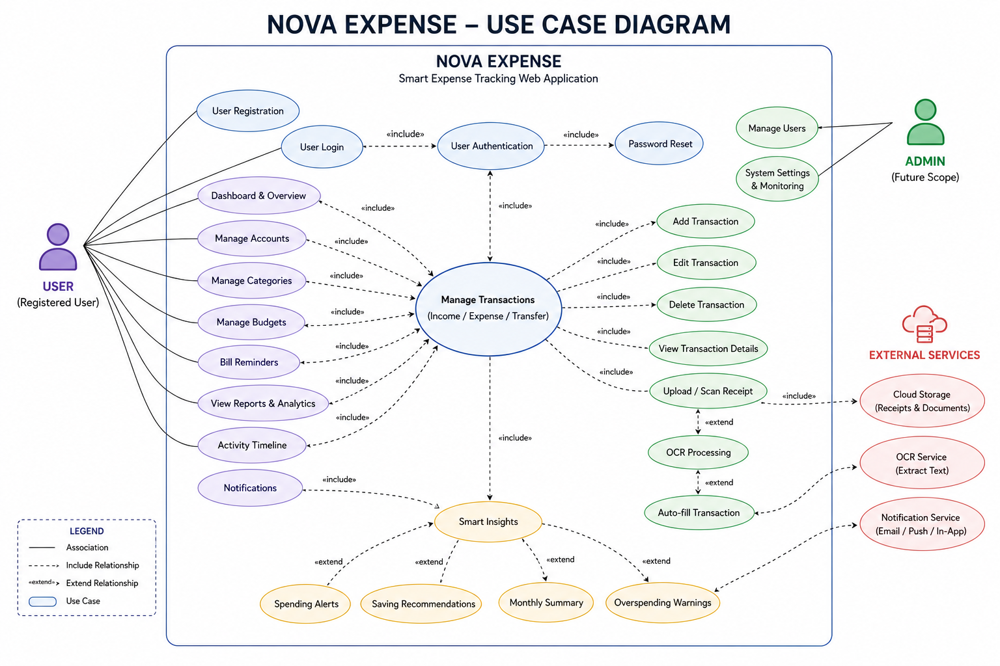
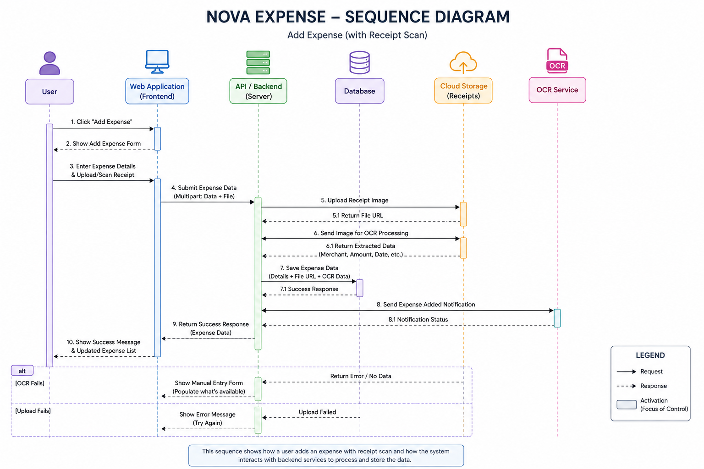
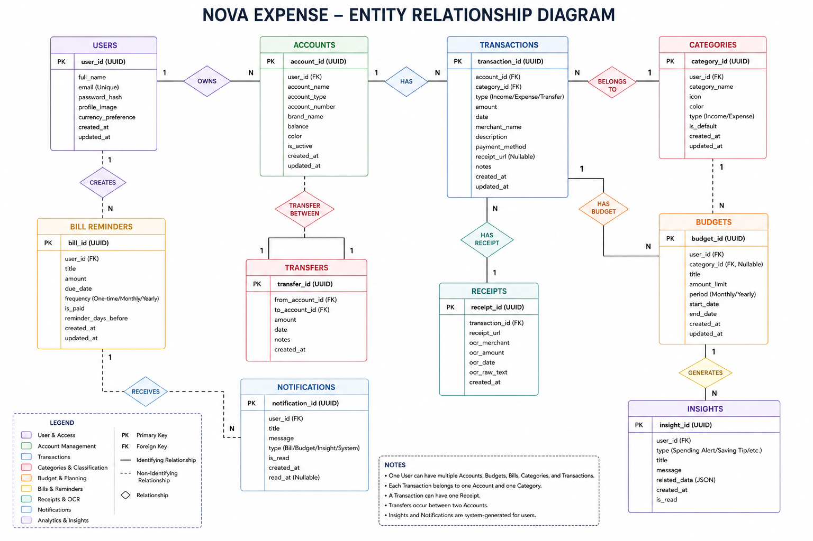
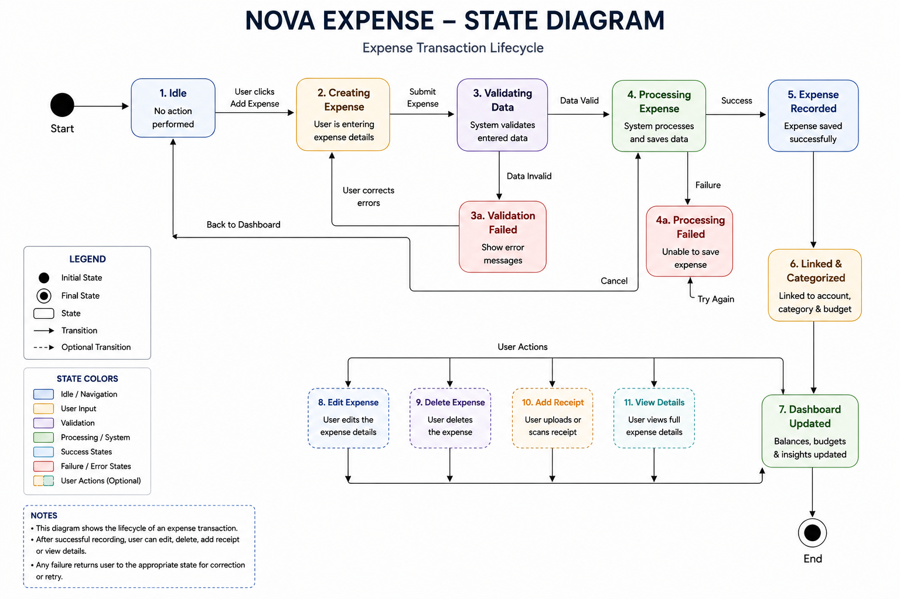

# Software Requirements Specification (SRS)

# Nova Expense – Smart Expense Tracking Web Application

---

## Preface

This document provides the Software Requirements Specification (SRS) for the **Nova Expense** system. It defines the functional requirements, non-functional requirements, system architecture, user roles, and future scalability plans for the application.

Nova Expense is a modern mobile-first expense tracking web application designed to simplify personal finance management through smart insights, budgeting, bill reminders, analytics, receipt scanning, and AI-powered financial tracking.

---

# Version History

* **Version 1.0** – Initial Draft.
 

---

# 1. Introduction

## Purpose

Nova Expense is a web-based smart finance management system developed to help users efficiently manage expenses, income, savings, budgets, bills, and financial goals from a single platform.

The system provides real-time expense tracking, smart financial insights, receipt scanning using OCR, budget monitoring, spending analytics, and cloud synchronization to deliver a modern personal finance experience.

The application is designed with a premium mobile-first interface to ensure seamless usability across devices.

---

## Document Conventions

This document follows the IEEE SRS standard, using:

* **Must** – Indicates mandatory requirements.
* **Should** – Indicates recommended functionality.
* **May** – Indicates optional or future enhancements.

---

## Intended Audience and Reading Suggestions

### Developers & Engineers

For implementation guidance, architecture understanding, and database design.

### UI/UX Designers

For interface flow, dashboard structure, and mobile-first design requirements.

### Testers & QA Teams

For validating application behavior, security, and system performance.

### Stakeholders & Product Owners

For understanding product capabilities and future scalability.

---

## Scope

Nova Expense provides:

* Smart expense and income tracking
* Multi-account financial management
* Budget planning and monitoring
* AI-powered financial insights
* Bill reminder system
* OCR-based receipt scanning
* Real-time analytics and reporting
* Cloud synchronization
* Secure authentication system
* Responsive mobile-first UI/UX
* Category management
* Financial activity timeline
* Savings tracking and spending analysis

---

## References

* IEEE Standard 830-1998 (Software Requirements Specification)
* Personal Finance Application Research Documentation
* UI/UX Design Specifications
* System Architecture Documentation

---

# 2. Overall Description

## Product Perspective

Nova Expense is a standalone cloud-based web application built with modern frontend technologies including:

* React
* TypeScript
* Vite
* Tailwind CSS
* TanStack Router

The application integrates cloud storage, OCR systems, and analytics modules to provide intelligent financial management features.

---

## Product Functions

### Expense Tracking

* Add, edit, delete, and categorize expenses.
* Track expenses in real time.
* View expense history and daily activity.

### Income Management

* Record salary, business income, and other earnings.
* Calculate total monthly income automatically.

### Account Management

* Manage multiple financial accounts/cards.
* Track balances and account activity.
* Support custom card colors and account branding.

### Budget Management

* Create monthly or category-based budgets.
* Monitor spending limits.
* Receive alerts when budget limits are exceeded.

### Smart Financial Insights

* AI-powered spending analysis.
* Weekly and monthly financial summaries.
* Spending pattern detection.
* Personalized saving recommendations.

### Bill Reminder System

* Manage recurring bills and due dates.
* Receive payment reminders and notifications.

### Receipt Scanner

* Upload or capture receipt images.
* OCR extracts merchant name, amount, and date.
* Auto-fill transaction forms from receipts.

### Analytics & Reports

* Visual financial reports and charts.
* Weekly spending analysis.
* Savings rate tracking.
* Expense category breakdown.

### Cloud Synchronization

* Sync user data across devices in real time.
* Secure cloud-based data storage.

### Notification System

* Budget alerts
* Bill reminders
* Financial warnings
* Insight notifications

---

## User Classes and Characteristics

### Guest User

* Can explore landing page.
* Must register/login to access features.

### Registered User

* Manage expenses and budgets.
* Access analytics and reports.
* Use receipt scanner and smart insights.

### Admin (Future Scope)

* Monitor system performance.
* Manage users and analytics.
* Handle reports and system configurations.

---

## Operating Environment

### Frontend

* React + TypeScript
* Tailwind CSS
* Vite

### Backend

* Node.js (Future Expandable)
* REST API / Cloud Services

### Database

* Cloud-based NoSQL Database

### Platforms

* Chrome
* Firefox
* Edge
* Safari
* Android browsers
* iOS browsers

---

## Design and Implementation Constraints

* Mobile-first responsive design is mandatory.
* Cloud synchronization must work in real time.
* OCR processing accuracy depends on receipt quality.
* Secure authentication and encrypted data handling required.
* System should support scalable architecture.

---

## Assumptions and Dependencies

* Internet connection is required for synchronization.
* OCR requires camera or image upload access.
* Users must have authenticated accounts.
* Future AI modules may require additional cloud services.

---

# 3. System Requirements Specification

# Functional Requirements

---

## User Authentication

* The system must allow users to register using email and password.
* The system must support secure login and logout functionality.
* The system must support password reset functionality.
* The system must maintain authenticated user sessions.
* The system must securely store user credentials.

---

## Dashboard System

* The dashboard must display:

  * Total balance
  * Weekly spending
  * Savings rate
  * Smart insights
  * Recent activity
  * Upcoming bills

* The dashboard must support responsive mobile layouts.
* The dashboard should remain clean and minimal.
* Smart insight cards may be expandable or collapsible.

---

## Expense Management

* Users must be able to:

  * Add expenses
  * Edit expenses
  * Delete expenses
  * Categorize expenses

* Expenses must support:

  * Amount
  * Category
  * Date
  * Merchant name
  * Notes
  * Receipt image

* The system must calculate total expenses automatically.

---

## Income Management

* Users must be able to add and manage income transactions.
* Income entries must update account balances automatically.
* The system must generate monthly income summaries.

---

## Transfer System

* Users must be able to transfer balances between accounts.
* Transfers must update both accounts automatically.

---

## Account Management

* Users must be able to:

  * Create accounts
  * Edit accounts
  * Delete accounts

* Each account must include:

  * Account name
  * Account type
  * Balance
  * Brand name
  * Card color
  * Account number

* The system must calculate real-time balances.

---

## Receipt Scanner

* Users must be able to upload receipt images.
* Users must be able to scan receipts using device cameras.
* OCR should extract:

  * Amount
  * Merchant name
  * Date

* Users must be able to manually correct OCR data.
* The system should improve OCR accuracy over time.

---

## Category Management

* The system must provide built-in categories.
* Users must be able to create custom categories.
* Categories should support custom icons/colors.

---

## Budget Management

* Users must be able to create spending budgets.
* Budgets may be monthly or category-based.
* The system must track budget usage percentage.
* The system must send alerts when budgets exceed limits.

---

## Smart Insights System

* The system must analyze spending patterns.
* The system should provide:

  * Saving recommendations
  * Spending alerts
  * Monthly financial summaries
  * Overspending warnings
  * Spending trend analysis

* Insights should be dynamically updated.

---

## Bill Reminder System

* Users must be able to create bill reminders.
* Bills must support recurring schedules.
* The system must notify users before due dates.

---

## Analytics & Reporting

* Users must be able to view:

  * Spending trends
  * Savings rate
  * Expense categories
  * Financial summaries

* Reports should support:

  * Daily view
  * Weekly view
  * Monthly view

* Reports should be exportable in PDF and CSV formats.

---

## Activity Timeline

* The system must display transaction history grouped by date.
* Daily spending totals should be visible.
* Remaining account balance should be shown alongside daily activity.

---

## Cloud Synchronization

* User data must sync across devices.
* Updates must reflect in real time.
* Data synchronization must be secure.

---

## Notification System

* The system must notify users about:

  * Bill due dates
  * Budget limits
  * Smart financial insights
  * Important account updates

---

# Non-Functional Requirements

---

## Performance Requirements

* The system must support real-time updates.
* Dashboard loading time should remain under 3 seconds.
* OCR processing should complete within reasonable time.
* System should support 1000+ concurrent users.

---

## Security Requirements

* All user data must be encrypted.
* Authentication tokens must be securely handled.
* Sensitive financial information must remain protected.
* The system must implement secure session handling.

---

## Usability Requirements

* The system must provide intuitive UI/UX.
* Mobile-first experience is mandatory.
* Navigation should remain simple and clean.
* Accessibility standards should be maintained.

---

## Reliability and Availability

* System should maintain 99.9% uptime.
* Backup systems must exist for recovery.
* Cloud synchronization failures should retry automatically.

---

## Maintainability

* Codebase must remain modular and scalable.
* Components should be reusable.
* Logging and debugging systems must exist.

---

## Scalability

* Architecture should support future mobile applications.
* System should support additional AI features in future.
* Infrastructure should scale based on user growth.

---

## Portability

* The application must work across:

  * Windows
  * macOS
  * Linux
  * Android
  * iOS

* Cloud deployment must be supported.

---

# 4. System Models

> * **CONTEXT DIAGRAM**

---

> * **ACTIVITY DIAGRAM**

---

> * **USE CASE DIAGRAM**

---

> * **SEQUENCE DIAGRAM**

---

> * **ENTITY RELATIONSHIP DIAGRAM**

---

> * **STATE DIAGRAM**

---

# 5. System Evolution

## Assumptions

* AI-powered financial analysis will continue improving.
* Future native mobile applications may be developed.
* Additional cloud services may be integrated.

---

## Expected Changes

### AI Integration

* Smarter spending predictions
* AI-based saving suggestions
* Automated financial health scoring

### Banking Integration

* Bank account synchronization
* Transaction auto-import

### Advanced Analytics

* Investment tracking
* Financial forecasting
* Multi-currency support

### Premium Features

* Shared family budgeting
* Team expense tracking
* Subscription management

---

# 6. Appendices

# Hardware Requirements

* Cloud-based scalable hosting infrastructure
* Backup storage systems
* OCR-compatible image processing support

---

# Software Requirements

### Frontend

* React
* TypeScript
* Tailwind CSS
* Vite

### Backend

* Node.js / Cloud Functions

### Database

* Cloud NoSQL Database

### APIs & Services

* OCR Processing Service
* Cloud Storage Service
* Notification Service

---

# Database Requirements

The database must support:

* User authentication data
* Transaction records
* Budget records
* Bill reminders
* Account balances
* Analytics data
* Receipt image storage
* Real-time synchronization

---

# Glossary

| Term | Meaning |
|---|---|
| OCR | Optical Character Recognition |
| Smart Insights | AI-generated financial recommendations |
| Budget Limit | Maximum allowed spending amount |
| Cloud Sync | Real-time synchronization across devices |
| Analytics | Financial reports and data visualization |

---

# Conclusion

Nova Expense is a modern smart finance management application designed to simplify personal financial tracking through intelligent analytics, cloud synchronization, AI-powered insights, budgeting tools, and premium mobile-first user experience.

The system aims to provide users with better financial awareness, smarter spending habits, and a seamless modern expense management solution.
